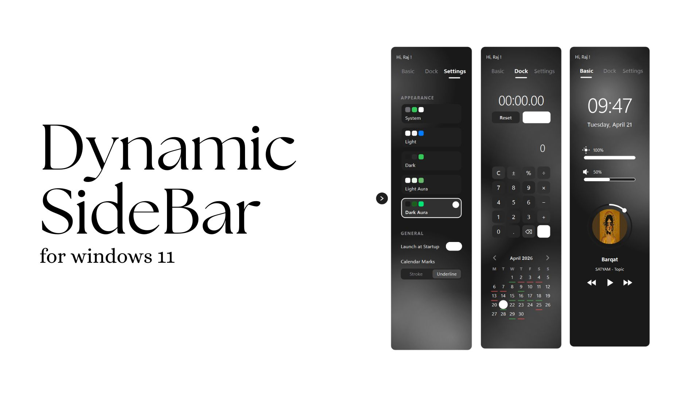
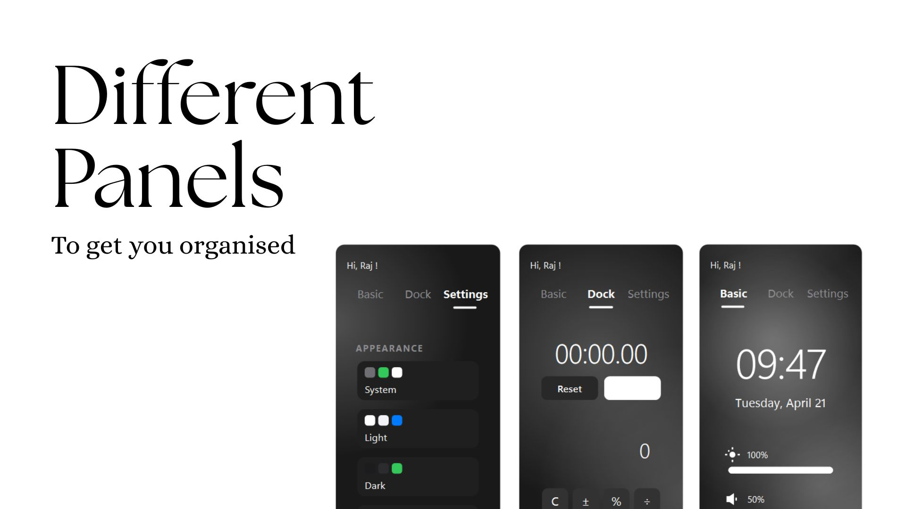
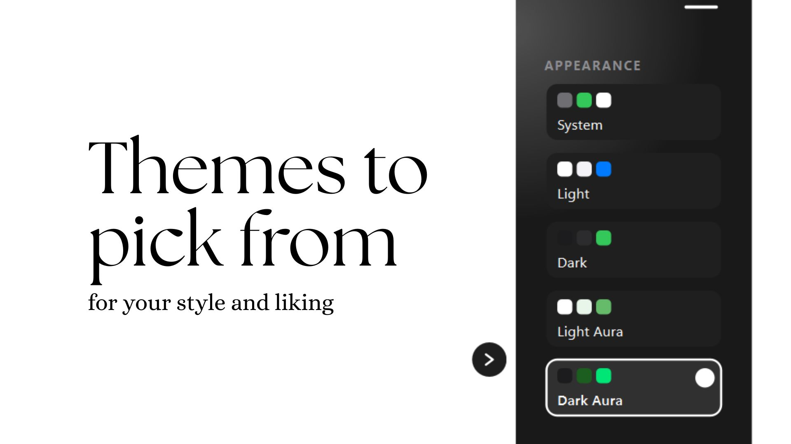
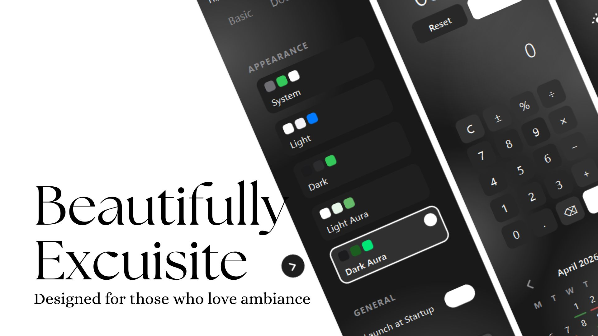
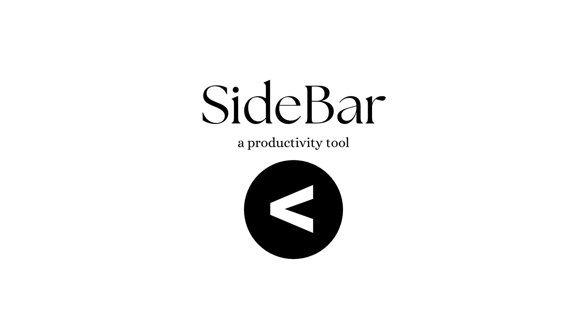

<!-- Creator : github.com/rajsriv -->
# Dynamic SideBar for Windows 11



Dynamic SideBar is a premium productivity tool designed for Windows 11. It provides a sleek, glassmorphic dock that integrates essential system controls, media management, and productivity widgets directly into your desktop experience.

## ✨ Key Features

### 🎨 Design & Personalization
- **Wallpaper-Adaptive Theming**: A state-of-the-art feature that extracts dominant and accent colors from your current Windows wallpaper to create a perfectly synchronized look.
- **Glassmorphic UI**: High-fidelity design with semi-transparent backgrounds, frosted glass effects, and smooth animations.
- **Theme Modes**: Choose from five distinct modes: `System`, `Light`, `Dark`, `Light Aura`, and `Dark Aura`.
- **Responsive Animations**: Fluid transitions for tab switching, hover states, and widget interactions.

### 🛠️ Functionalities in Detail

#### 1. Basic Productivity Panel
- **Digital Clock**: Clear and elegant real-time time display.
- **Integrated System Controls**: 
  - **Brightness**: Adjust screen brightness with a custom-designed slider.
  - **Volume**: Manage system volume directly from the sidebar.
- **Media Controller**: 
  - Real-time track information (Title, Artist).
  - Interactive **Progress Ring** for visualizing track position and seeking.
  - Interactive **Lava Lamp** animation as a fallback for missing album art.
  - Full playback controls (Play/Pause, Next, Previous).



#### 2. Productivity Dock Panel
- **Smart Calculator**: A fully functional arithmetic calculator with a clean, modern interface.
- **Precision Stopwatch**: Track time with ease, featuring start, stop, and reset capabilities.
- **Visual Calendar**: A sleek calendar widget with customizable event marking styles (`Stroke` or `Underline`).



#### 3. Settings & Configuration
- **Appearance Switcher**: Easily switch between theme modes.
- **Launch at Startup**: Integrated option to toggle the app's autostart via Windows Registry.
- **Calendar Customization**: Adjust how marks appear on your calendar.



## 🚀 Tech Stack

- **Language**: Python 3.x
- **UI Framework**: PyQt6 (Qt for Python)
- **Core Dependencies**:
  - `darkdetect`: For system theme synchronization.
  - `PIL (Pillow)`: For color extraction and image processing.
  - `screen_brightness_control`: For hardware brightness integration.
  - `pycaw`: For advanced Windows audio control.
  - `comtypes`: For interacting with Windows API components.

## 🛠️ Installation & Setup

1. **Clone the repository**:
   ```bash
   git clone https://github.com/rajsriv/Dynamic-sideBar-for-windows.git
   cd Dynamic-sideBar-for-windows
   ```

2. **Install dependencies**:
   ```bash
   pip install PyQt6 darkdetect pillow screen-brightness-control pycaw comtypes
   ```

3. **Run the application**:
   ```bash
   python main.py
   ```

## 📦 Building the Executable

If you wish to build a standalone `.exe` for Windows, use the provided `.spec` file with PyInstaller:
```bash
pyinstaller updock.spec
```

---



Designed with ❤️ for Windows 11 Enthusiasts.
